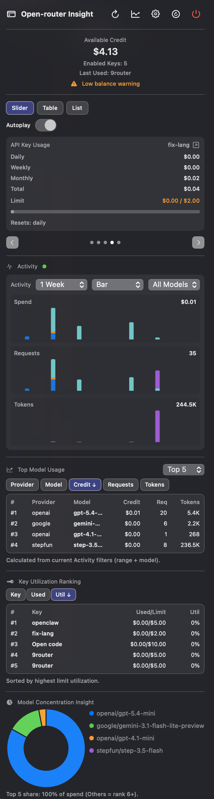

# Open-router Insight

Open-router Insight is a native macOS menu bar app that monitors your OpenRouter credit balance and usage in real time.
It is built for developers who want fast visibility into spend, key activity, and usage trends without opening the OpenRouter dashboard.

## Highlights

- Lives in the macOS menu bar for quick access
- Shows remaining credits, total usage, and key-level spend
- Includes activity charts, model concentration insights, and rankings
- Supports anomaly and low-credit notifications
- Offers one-command local build and install

## Screenshots



More screenshots are available in `screenshots/`.

## Requirements

- macOS 15.4+
- Xcode 16+
- An OpenRouter API key

## Quick Start

```bash
git clone https://github.com/anhdd-kuro/OpenRouterCreditMenuBar.git
cd OpenRouterCreditMenuBar
./scripts/build.sh --install
```

Then open **Open-router Insight** from `/Applications`.

## Development

Build from the repository root:

```bash
xcodebuild -project "OpenRouterCreditMenuBar.xcodeproj" -scheme "OpenRouterCreditMenuBar" -configuration Debug build
```

Release build:

```bash
xcodebuild -project "OpenRouterCreditMenuBar.xcodeproj" -scheme "OpenRouterCreditMenuBar" -configuration Release build
```

Build and install helper:

```bash
./scripts/build.sh --install
```

## Testing

Run all tests:

```bash
xcodebuild test -project "OpenRouterCreditMenuBar.xcodeproj" -scheme "OpenRouterCreditMenuBar" -destination "platform=macOS"
```

Run only unit tests:

```bash
xcodebuild test -project "OpenRouterCreditMenuBar.xcodeproj" -scheme "OpenRouterCreditMenuBar" -destination "platform=macOS" -only-testing:"OpenRouterCreditMenuBarTests"
```

Run only UI tests:

```bash
xcodebuild test -project "OpenRouterCreditMenuBar.xcodeproj" -scheme "OpenRouterCreditMenuBar" -destination "platform=macOS" -only-testing:"OpenRouterCreditMenuBarUITests"
```

Run a single test:

```bash
# Swift Testing
xcodebuild test -project "OpenRouterCreditMenuBar.xcodeproj" -scheme "OpenRouterCreditMenuBar" -destination "platform=macOS" -only-testing:"OpenRouterCreditMenuBarTests/OpenRouterCreditMenuBarTests/example()"

# XCTest UI
xcodebuild test -project "OpenRouterCreditMenuBar.xcodeproj" -scheme "OpenRouterCreditMenuBar" -destination "platform=macOS" -only-testing:"OpenRouterCreditMenuBarUITests/OpenRouterCreditMenuBarUITests/testExample"
```

## Configuration

In Settings, you can configure:

- OpenRouter API key
- Refresh interval
- Launch at login
- Warning threshold alerts and key anomaly alerts

The app stores lightweight preferences in `UserDefaults`.

## Architecture Overview

- `OpenRouterCreditManager` handles API calls, cached activity data, and app state
- `MenuBarView` renders current credit, usage views, charts, and ranking sections
- `ActivityChartsView` renders spend/request/token charts with hover tooltips
- `SettingsView` manages app preferences and connection checks
- `AppLogger` writes runtime events to log files for debugging

## Privacy and Security Notes

- API calls use bearer authentication to OpenRouter endpoints
- Sensitive values such as API keys should not be logged
- Notifications are local macOS notifications only

## Contributing

1. Create a branch from `main`
2. Make focused changes
3. Run build and relevant tests
4. Open a pull request with clear context

See `AGENTS.md` for repository-specific commands and coding conventions used by coding agents.

## License

This project is licensed under the MIT License. See `LICENSE` for details.
